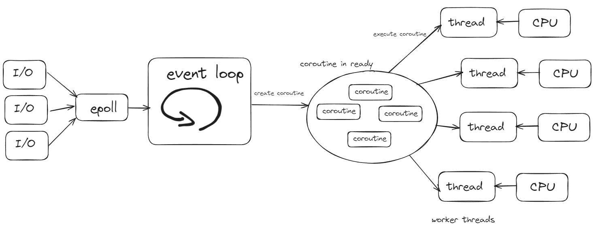

### 요약: 현대 서버 기술은 이벤트, 스레드, 코루틴을 적재적소에 사용한다.

서버의 목적은 많은 I/O를 병목 없이 처리하는 것이다.
단순히 프로그램을 하나씩 실행하거나, 스레드 하나당 프로그램을 하나씩 사용하거나,
요청마다 스레드를 생성하는 방법만으로는 최대 효율을 낼 수 없다.

서버 기술의 핵심은 N개의 고객 요청을 제한된 CPU 자원에 효율적으로 분배하는 것이다.
1. 스레드의 갯수는 N에 비해 턱 없이 적기 때문에, 각 요청에 스레드를 전담시키는 것은 비효율적이다.
   (C10k 문제: https://en.wikipedia.org/wiki/C10k_problem)
2. 스레드 외에도, 코루틴을 사용하여 비동기적으로 코드를 실행하며, 또한 이벤트 기반 프로그래밍과 결합한다.
   Async, 이벤트 드리븐 프로그래밍, RPC 등은 코루틴을 이용한 기술로 볼 수 있다.
3. 작업의 특성에 따라, 블로킹 작업과 논블로킹 작업에 대해 서로 다른 전략을 사용하여 자원을 효율적으로 사용한다.

그래서 아래 처럼 서버를 만들면 좋다는 것이다.

### 좀 더 근본적인 고민
서버 프로그래머의 목표는
제한된 성능으로 최대한 많은 할 일을 '효율적인' 지연으로 해결하는 일이라고 생각한다.

만약 서버가 무한히 빠르다면, 이벤트, 스레드, 코루틴을 고민할 필요가 없다.
내가 마음대로 서버 성능을 N배 뻥튀기 할 수 있으면,
전세계에서 동시에 하나의 서버에 요청한다해도,
1초 안에 절차적으로 하나의 CPU 코어에서 모든 할 일을 처리할 수 있다.

반대로 내가 가진 서버가 50년 전 컴퓨터라면,
마찬가지로 고민이 크게 의미가 없다.
동시에 들어온 2개의 요청을, 1시간 뒤에 하나 응답을 보내고 2시간 뒤에 하나 응답을 보내는 것 대비
1시간 30분 뒤에 두 개의 응답을 동시에 보낸다고 해도 나는 해고 당한다.

결국 서버 프로그래머가 고민해야 하는 것은,
적당한 서버를 이용해서 좀 버거운 수의 요청이 들어왔을때에도 지나친 지연 없이 모든 할일을 처리하는 것이다.

프로세스, 스레드, 코루틴, 이벤트 드리븐 프로그래밍 등 책에서 다루는 모든 것은 이 목표를 달성하기 위한 수단일 뿐이다.

- 스레드는 프로세스 간의 컨텍스트 스위칭을 줄이기 위한 수단이다.
- 코루틴은 스레드 간의 컨텍스트 스위칭을 줄이기 위한 수단이다.
- 이벤트 드리븐 프로그래밍은 블로킹 작업을 효율적으로 처리하기 위한 수단이다.

이 세 가지는 같은 의미를 같는다. 일을 더 잘게 쪼개는 것이 가능하도록 만들어 준다.

# 최종 요약:
***서버 프로그래머는
제한된 성능으로 최대한 많은 할 일을 '효율적인' 지연으로 해결하기 위해
일을 잘게 쪼갠 다음 서버 컴퓨팅 자원에 쪼개진 일을 나눠주는 전략을 고민한다.***

이 목표를 갖고 프로그램을 만든다면, 자연스럽게
스레드, 코루틴, 이벤트 드리븐 프로그래밍 등을 사용하게 되지 않을까?

