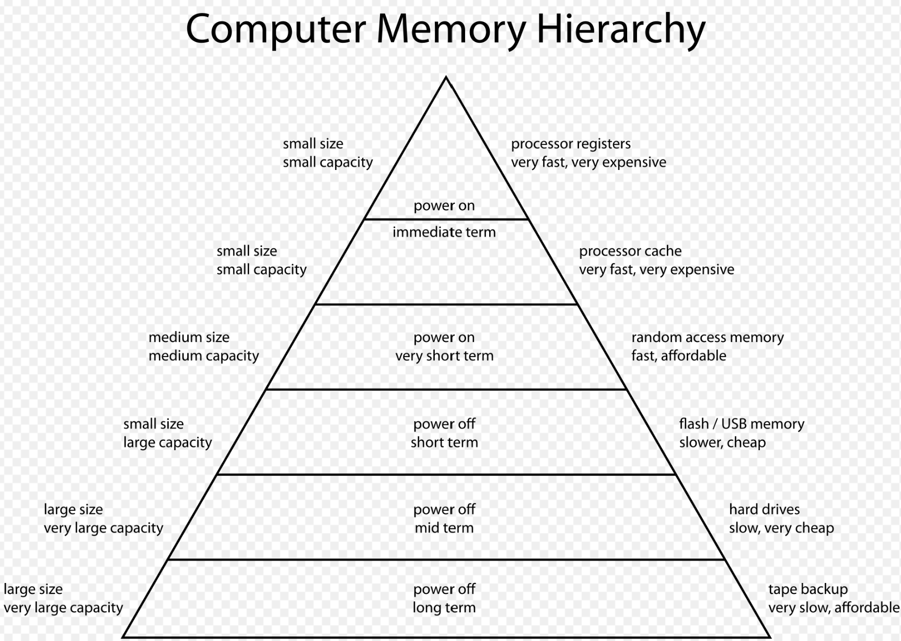
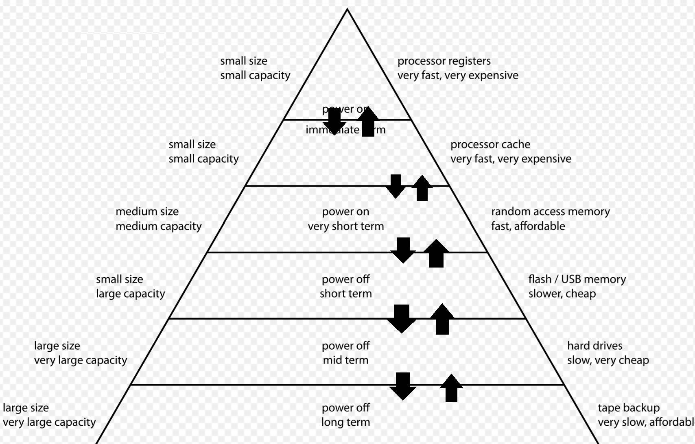
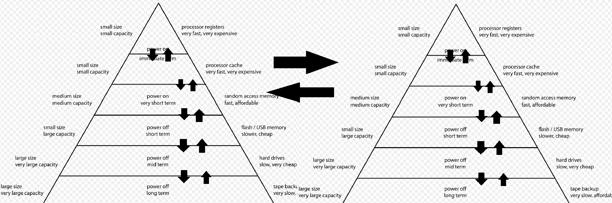

### Cache 핵심 요약

1. 캐시는 access speed가 다른 두 기술(layer) 사이에 들어가서 전체 시스템이 가장 느린 기술의 속도를 따라가지 않도록 한다.
   1. 캐시가 없으면, 시스템은 가장 느린 기술의 속도보다 빨라질 수 없다.
  
2. 캐시는 가장 빠르고 비싼 기술에서 저렴하고 메모리 확보가 쉬운 기술로 피라미드 구조를 이룬다.
   1. 만약 상위 레이어가 하위 레이어보다 많은 메모리를 사용할 수 있다면, 해당 하위 레이어는 필요없는 레이어이다.

3. 속도가 느린 시스템에 대한 접근을 줄여주는 효과도 있다.

  
3. 캐시는 다음의 합이라고 봐도 된다.
   1. Map 자료 구조 
   2. 다중 Map 데이터 불일치 해결 로직
      1. 하나의 피라미드에서 불일치 
      2. 여러 개의 피라미드에서 불일치 
   3. 부족한 캐시 공간 활용 로직

### cache를 실무에서 사용할때도 2, 3번를 고민해보자.

